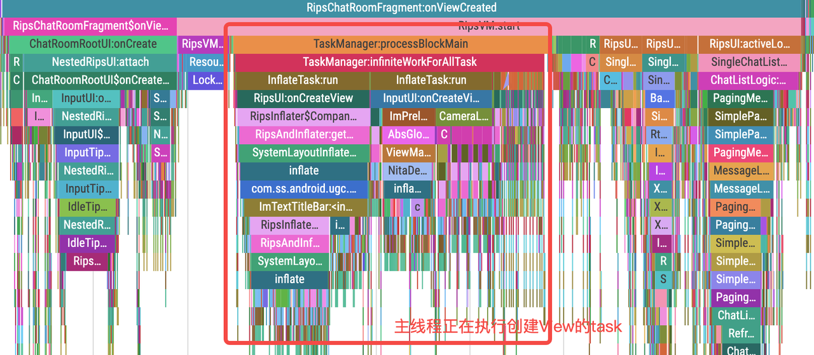

# 简介
一句话描述，Rips是一个轻量级的页面内的组件化框架，可以基于页面内以view作为维度，拆分成逻辑独立的组件以达到逻辑解耦、复用等目的。可以认为是“更轻量级的fragment”

# 如何使用
Rips是一个单项数据流框架，一个组件包含三个元素
ui元素: 描述一个组件长成什么样子
logic元素: 描述一个组件的数据从何而来
state元素： 对ui的抽象，dataClass, 是ui和logic的粘合剂

## Fragment视角
从activity或者fragment的视角，它们不再存在业务逻辑，唯一的任务是组装组件。由于rips支持组件嵌套，因此我们先在fragment层面定义一个Root组件

```kotlin
//RipsChatRoomFragment.kt
override fun onCreateView(inflater: LayoutInflater, container: ViewGroup?, savedInstanceState: Bundle?): View? {
    return inflater.inflate(R.layout.im_chat_room_rips_root_layout, container, false)
}

override fun onViewCreated(view: View, savedInstanceState: Bundle?) {
    super.onViewCreated(view, savedInstanceState)
    //...
    scopedData {
        provider {
            sessionInfo
        }
    }

        attach {
            bindRipsUI()
    }
    //...
}

protected open fun RipsVM.bindRipsUI(){
    bind(SingleChatRoomRootUI(this@RipsChatRoomFragment), R.id.rips_root_container)
}
```
Root组件里面可以存在不属于其他任何组件的公共逻辑，以及安排各个位置应该显示什么组件。可以看到我们现在xml里面为每个组件占坑，然后指定每个坑位绑定的组件
```xml
<?xml version="1.0" encoding="utf-8"?>
<FrameLayout xmlns:android="http://schemas.android.com/apk/res/android"
    xmlns:tools="http://schemas.android.com/tools"
    android:id="@+id/chat_root_layout"
    android:layout_width="match_parent"
    android:layout_height="match_parent">
    
    <!--可以用viewStub或者任何ViewGroup占位-->

        <ViewStub
            android:id="@+id/chat_title_container"
            android:layout_width="match_parent"
            android:layout_height="wrap_content" />

        <LinearLayout
            android:id="@+id/top_bar_container"
            android:layout_width="match_parent"
            android:layout_height="wrap_content"
            android:orientation="vertical" />
            
 </FrameLayout>
```
```kotlin
//ChatRoomRootUI.kt
override fun onCreate() {
    super.onCreate()
    attach {
    measureVMTime("rips_vm_setupUI") {
        val isReport = sessionInfo.selectMsgType == EnumType.SELECT_MSG_REPORT
        if (isReport) {
            bind(ReportChatListUI(owner), R.id.chat_list_container)
            bind(ReportTitleUI(owner), R.id.chat_title_container)
        } else {
            bindTitle()
            bind(InputUI(owner), R.id.input_container)
            bind(UnreadTipsUI(owner), R.id.unread_message_tips_container)
            bind(InputPanelUI(owner), R.id.panel_container)
            bind(NewMsgTipsUI(owner = owner), R.id.new_message_tips_view_container)
            bind(InteractiveUI(owner), R.id.im_interactive_emoji_container)
            bind(AudioUI(owner), R.id.audio_container)
            bind(GifBattleCountUI(owner), R.id.gif_battle_count_container)
            bind(GifSearchResultUI(owner), R.id.layout_panel_gif_view_container)
            bind(LocalMessageUI(owner), R.id.chat_bottom_card_container)
            bind(GifSearchUI(owner), R.id.gif_search_container_old)
            bindTopTips()
            bindMessageList()
            if (VoiceOptExperiment.enableNew) {
                bind(AudioTouchUI(owner), R.id.touch_container)
            }
        }
    }
}
}
```
UI元素视角
1. 泛型部分绑定了logic元素和state元素
2. layoutResource函数返回当前组件布局
3. onViewCreated类似fragment的api不再赘述
4. 可以观察uiState的数据来改变ui

因此ui元素只做ui相关操作，显示or隐藏，是否展示动画等
```kotlin
class UnreadTipsUI(owner: ViewModelStoreOwner) : RipsUI<UnreadTipsLogic, UnreadTipsState>(owner) {

    companion object {
        const val TAG = "UnreadTipsUI"
    }

    private val mContext: Context = find()
    private lateinit var mUnreadMessageTips: View
    private lateinit var mUnreadMessageCount: DmtTextView
    private var mUnreadMessageImage: ImageView? = null

    override fun layoutResource(): Int {
        return R.layout.im_view_stub_unread_message_tips
    }

    override fun onViewCreated(myView: View) {
        super.onViewCreated(myView)
        //findViewById等逻辑
        //观察数据
        uiState.observe(find()) {
            if (it.show) {
                it.marginTop?.also { top ->
                    (myView.layoutParams as? ViewGroup.MarginLayoutParams)?.topMargin = top
                }
                if (myView.visibility != View.VISIBLE) {
                    showUnreadMessageTips(it.unreadCount)
                }
            } else {
                hideUnreadMessageTips()
            }
    
            if (it.showLoadingAnimation) {
                mUnreadMessageImage?.setImageDrawable(ContextCompat.getDrawable(find(), R.drawable.im_ic_refresh_small))
                mUnreadMessageImage?.startAnimation(mImageRotateAnimation)
            } else {
                mUnreadMessageImage?.clearAnimation()
            }
        }
}
```
## State元素视角
它是对ui的抽象，ui元素会观测它的字段来决定ui显示逻辑。定义为dataClass，属性为val， 以此来做单项数据流，这样ui层只能观测数据而不能改变它
```kotlin
data class UnreadTipsState(
    val show: Boolean,
    val unreadCount: Long = 0L
): State
```
## Logic元素视角
logic元素是请求数据的地方，一般在onCreate里面发起该组件的数据请求，在任意地方调用setState去刷新ui。从结构上讲，logic元素只包含数据请求和组装部分，它并不知道ui怎么响应，它只是设置了State
```kotlin
class UnreadTipsLogic(injectionAware: InjectionAware) 
    : BasicRipsLogic<UnreadTipsState>(injectionAware) {
    
    override fun onCreate() {
        super.onCreate()
        //伪代码
        //可以在任意地方调用setState即可更新ui
        retrofit().getUnreadCount{ count ->
            setState{
                copy(show = true, unreadCount = 10)
            }
        }
    }
    
    override fun onResume() {
        super.onResume()
    }
}
```
以上是最简单的一个rips组件demo，站在一个组件的角度，它必须知道自己显示成什么样(ui视角)，它必须知道数据来自哪里(logic视角)，它还需要知道自己被放到界面的哪个位置(fragment视角)。思考好这几点后自然就清楚一个rips组件如何去写了
# 原理分析
## 界面是怎么展示的？
下面我们先来看看rips组件是如何运行起来的，以此来加深使用的理解。我们知道一个activity展示出来的步骤大概分为以下几步。首先调用startActivity后会调用前一个界面的onPause，然后调用目标Activity的onCreate，onResume，在onCreate里面我们先setContentView设置布局，然后接着请求数据，如果请求是异步的，则主线程会先发起measure、layout、draw然后显示界面首帧，此时是没有数据的，因此可能显示白屏、骨架图、loading等。等数据异步回来后再刷新ui，界面闪一下后就会正常展示了

上面的流程对应的是整个activity/fragment， 因此一旦界面复杂就可能在onCreate里面出现一堆获取view的代码，如果不同的ui部分数据来源不同，甚至需要顺序的去请求多个数据源，在获取到数据后，还需要把整个界面的数据拆分到各个view中去，因此fragment中代码往往特别复杂，且各个代码之前存在时序、逻辑等依赖，最后导致难以维护。rips考虑做界面内组件化，即把以上的这个生命周期图分发到每个组件中去

现在不同于原来，我们在界面绘制首帧前，定义一堆组件的生命周期。会循环调用所有组件的生命周期，用以执行它们各自的逻辑。比如框架调用UI元素的onCreateView，就会拿到当前组件的view然后把它塞到先前定义的坑位中，框架调用logic元素的onCreate就会发起数据流请求，等数据回来后就能刷新组件的ui。从根本上讲我们没有改变系统展示一个界面的逻辑，只是自定义构建了一些组件元素插入到系统流程中而已
## 从SysTrace看流程
下图是之前的逻辑流程，可以看到在ChatRoomActivity的onStart里面开始创建ChatRoomFragment，先调用onCreateView创建好布局，然后调用onViewCreated执行逻辑（这里就是BaseChatPanel里面的逻辑了），这个阶段执行完毕后系统回调下一个生命周期activityResume，然后就是执行绘制流程。

这里有两个问题
1. 我们很难知道BaseChatPanel里面有多少逻辑，如果要衡量每个逻辑耗时就更不大可能了
2. 整个逻辑都是串行化的，性能优化做起来有困难，之前我做了一次首帧速度的性能优化, 可以看看这个消息详情页首帧速度优化实战 ，里面使用了预加载来创建对象，这样可以，但是并不优雅，如果有多个需要预加载的对象，代码就会非常难看
```kotlin
//异步先创建
object: Preload{
    var xxManager: Manager? = null
    fun preload(){
        xxManager = createManager()
    }
}

//获取一次，如果没准备好就重新创建
class xxActivity: Activity{
    private manager: Manager? = null

    fun onCreate(){
        super.onCreate()
        manager = Preload.xxManager ?: createManager()
    }
}
```
然后让我们来看下rips的流程，我把整个fragment的生命周期整合成下面这样，大概分为3个阶段
1. 组件配置阶段，即下图红框左边的部分， 这部分rips框架会准备好各个组件之间的关系
2. 并发任务阶段，即下图红框的部分，这里也是rips最大特色的地方，它会充分利用多线程能力去加载所有组件（创建View和Logic）
3. 组件发布阶段，即红框右边的部分，当一个组件有了数据，创建好了view后，需要执行一些初始化逻辑，比如findViewById，把数据设置给view等等操作在这里执行


## 第一阶段：组件配置
我们来看看源码，起点是fragment里面的attach函数，从dsl的角度，它表示的是一个把xxUI和坑位绑定到一起的语义

bind函数只是一个记录操作，把对应id和ui放到一个map中保存映射关系，同时会回调组件的onCreate函数，而在嵌套组件onCreate里面可以继续bind自己的子组件，同样子组件的映射关系也会添加到这个map中

这个时候内存里面的UI树大概是下面这个样子

## 第二阶段：任务并发
这也是rips这个名字的来源，有一款AMD的cpu叫线程撕裂者ThreadRipper, 这个地方最大化利用了多线程的能力去完成一些耗时任务。业务开发无非就关心两个事，view怎么展示？数据怎么存储？这里最耗时的就是创建view和数据获取了。因此我的思路是把所有必须的、耗时的工作task化，然后在一段时间内统一执行
attach函数里面会创建一个RipsVM的ViewModel，因此rips的生命周期是跟随外层的activity或者fragment的，不会内存泄漏

来看看start函数干了什么? 把两种类型的task，uiTask和logicTask放到taskManager里面去，uiTask顾名思义是创建view的任务，它负责从xml中inflate出一个view实例来，比较耗时。logicTask即创建logic实例的任务，这个也可能耗时

这里解释下， 我们的xxLogic组件里面是请求界面数据的逻辑，往往会用到一些model层的类，比如定义一个属性val manager = xxManager(), 你很难知道这个xxManager的构造函数里面是否有耗时逻辑，这样在原来就很容易劣化性能而不自知。但是我们的Logic组件可能是在异步线程创建的，onCreate函数是在主线程调用的，这样就能比较优雅异步化一些耗时逻辑

如果是普通写法则会这样

最后调用TaskManager的processBlockMain，该函数会阻塞主线程直到所有任务都完成。这里设计了一个抢占式的任务队列，当所有任务都完成时，主线程才会放行

此时内存中的布局大概是这个样子

## 第三阶段：组件发布
当我们创建好了view实例和logic实例后，需要回调组件的onViewCreated方法，来设置数据到view上，这样首帧才能展示出我们想要的东西

rips引入了一个叫做首帧完整性的概念，可以看到这里也是做首帧控制的关键,简单说就是可以控制哪些组件是随首帧展示的，这个有三个时机，WithFirstFrame，AfterFirstFrame，Lazy。可以看到只有WithFirstFrame的组件才会调用onViewCreated和Logic组件的OnCreate，在onCreate去拿数据才会在首帧完整展示。因此其他组件在首帧前都只会展示view的【原始内容】并且无法响应点击事件
此时内存布局大概是这个样子

## 设计总结
现在了解完细节，我们再往上一个层次来看看框架设计这个事。
首先，上层需要考虑使用者如何方便使用，低成本上手，这部分我们把xxUI这个开发者第一时间接触到的类的api设计得和Fragment一致，因此只要会用framgent就知道rips组件是怎么回事。同时我们设计了一套语义化的dsl，用attach和bind可以清晰地表达组件和容器之间的绑定关系，因此什么组件放哪里就一目了然
其次，dsl虽然简单，但是需要执行的逻辑可不简单，我们对耗时业务抽象出task，交由taskManager做调度处理，这个地方只有足够的抽象程度才能支持各类任务的调度及扩展，这一层和上层是逻辑隔离的，因此可以在这里配置不同的调度策略以完成性能调优，比如开几个线程？是否需要主线程顺序执行等等
最后，我们引入了一些首帧控制的调度策略，用不同的策略，整个组件生命周期的回调执行时机就不同，因此一些低优先级的组件往往被设置为lazy的，它的生命周期就会在较晚时候才会回调，首帧展示速度就会加快。但是作为开发者，业务逻辑是不用改变的，他们甚至都不感知

# 深入思考技术Tips
## 如何最大化并行操作？
仔细想想，并行阶段会不会存在badcase，如果主线程执行完毕却等待子线程很久岂不是会白白浪费很多时间？如下图，红框部分即为空等待，我们需要尽可能减少空等待以提高性能。

这就是LeetCode的一道考题，最优调度问题，我现在有n个任务分给m个工人做，如何保证所有任务可以在最短时间内完成（哈哈，字节面试算法果然有道理的）
ShowCase1:  如果有4个任务，2个线程则可以按如下分配，任务抢占，最长时间理论上可能是5+8 = 13ms

ShowCase2:  如果有3个线程，还是抢占式，则理论上总时长10ms，可以看到不同线程数对总时长有一定影响

ShowCase3： 可能有badCase，即某个任务耗时特别长，那么时长可能会受最大耗时任务的影响，如下，抢占式任务总时长来到了32ms，可见【一个桶能装多少水取决于它最差的那块板】

ShowCase4： final方案，排序+抢占， 即先做耗时较大的任务，再抢占执行，可见时间已经优化到25ms

但是这个情况更复杂些，首先我们每个任务耗时多少是不清楚的，其次我们也不能开m个线程的线程池，因为可能增加整个app线程负担，最好是复用已有线程池，因此工人的数量也是不定的，而且我看LeetCode的普遍说的是回溯法，即循环+递归，这个分配任务的时间如果太长，就会出问题了，我们还阻塞着主线程呢。考虑到这些rips采用的是任务分级的方法，我把耗时较长的任务放到队列前端先执行，小的任务放到队尾，这样就能尽可能保证空等待时间减少

因此RipsUI上是可以指定一个优先级参数的，把耗时任务指定为high就好了。
## 并行加载View当真可行？
我们知道在子线程操作ui绘制是不可行的，但是在子线程inflate创建view却是可以的，这部分不要混淆。毕竟创建view只是从xml文件解析出view的各个节点并new一个view的实例就可以，因此从原理来说异步创建view完全可行，但是还是有些坑的。
问题1：比如抖音的nita框架，用application的context创建目标activity要使用的view，在深浅色模式下就会有bug。但是我们这里是用的activity作为context因此就规避了这个问题
问题2：还有一个问题是锁竞争， LayoutInflater在inflate的时候是有同步锁的！

因此如果各个线程都使用LayoutInflater.from(context)来创建view时就会用到同一个LayoutInflater实例

因此解决方案也比较明确了，不同线程使用不同的layoutInflater即可。调用cloneInContext就能使用不同实例LayoutInflater.from(context).cloneInContext(newCtx)，具体实现可以看到就是new一个PhoneLayoutInflater

问题3： AssertManager还存在锁竞争， 可以看到在Resource层面还存在锁，这个地方将会大大降低并行inflate的效率，线程的状态很多处于runnable而不是running


这里采用的优化方案是，构造不同的AssetsManager实例去避免锁竞争
简单来说我们需要使用新的context，而不是用原来的Activity作为context去加载资源，就可以使用到不同AssetsManager实例，Configuration里面有assetsSeq字段，把它反射修改后作为参数，通过context.createConfigurationContext就可以创建出一个ContextImpl实例。注意这个和用application作为context创建view是有区别的，原因在于下面的方案是【从Activity copy 出了一份configuration】，因此深浅色模式，density什么的配置都不会受影响。

这里还有个问题，如果view的context是ContextImpl，那么后续一些判断可能会出问题，比如有人会把context强转为activity，因此最后还需要把view的context做一次替换，递归操作view即可

## 组件之间交互是如何实现的？
rips采用一种ServiceLocator的方法来实现DI，任意组件可以向外暴露接口（如下InputApi），要暴露的api只需要实现ExposeApi这个标记接口即可。任意组件可以通过by inject获取其他接口，可以通过find()函数获取activity/fragment级别的全局变量。以此来完成组件间的通信

它的思想也很简单，在viewModel中放置一个map，以Class的type作为key，以具体实现接口对象作为value存放到该map中，不同地方只要能拿到该viewmodel即可获取想要的数据。

可以看到inject和find都是从injectionAware中获取的数据，而Rips组件默认都是实现了DI接口的，因此在rips组件内都是可以直接访问任意的其他组件接口的。下面是injectionAware的实现，可以看到实际上数据都是存储在RipsContainer的，它的实现就是HashMap

## 其他
还有一些细节有空可以看看源码，比如ExposeApi的接口想提供自定义的默认实现应该怎么做？比如refined关键字的用法？比如为什么框架可以为你的UI创建一个关联的logic，却不用手动提供实现等等有意思的技术细节可以有空研究下~