# MessageAdapter重构方案： Split
## 背景
目前在消息页面加一个新类型的消息成本巨大，至少需要在PlatformEnum加入新的message的Type，在MessageAdapter加入两个adapter的type：send & receive， 点击相关还需要加入一个viewTag的type，因此至少需要添加4个type，并且你还得注意和别人定义之间的冲突。除此之外各个类的职责不够清晰，MessageAdapter、MessageHandle、BaseChatPanel各个类相互混合了很多逻辑已经很难维护了。因此我们计划做一波重构设计，提高可维护性，为后续敏捷迭代打好基础

## 现状
MessageAdapter维护了一堆枚举
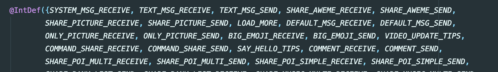
MessageAdapter 定义了消息的点击事件，一堆if..else
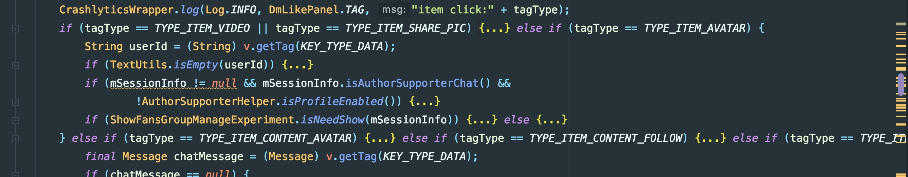
ViewHolderFactory 也是一堆switch
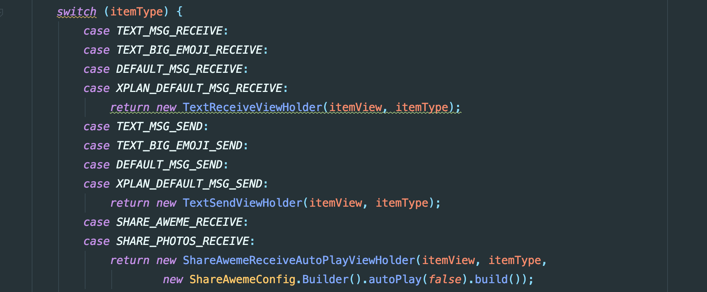
除此之外MessageViewType、LongClickListener、MessageLayoutHelp等都是大量的枚举逻辑，显然可维护性低，不符合开闭原则
## 分析
RecyclerView的思想核心是数据和ui一一绑定，通过adapter把数据适配成ui元素。根据代码设计可以总结为三种映射
1. 数据和ui-type映射，即 int getItemViewType(int position), 一般来说同种数据映射为一种type，不同数据对应不同type，目前实现为(message <-> uiType) 的转换
```kotlin
@Override
public int getItemViewType(int position) {
    if (position == 0 && ImHisMsgLoadMoreExperiment.getIS_OPEN()) {
        return LOAD_MORE;
    }
    Message chatMessage = mData.get(switchItemPos2DataPos(position));
    MessageViewType messageViewType = MessageViewType.valueOf(chatMessage);
    return messageViewType.getItemViewType();
}
```
2. ui-type和viewHolder映射， 即  onCreateViewHolder,  这一步是RecyclerView的内部转换， 即给定一个type，创建出一个与之相关的holder，目前实现是(uiType <-> ViewHolder)的转换
```kotlin
@Override
public BaseViewHolder onCreateViewHolder(@NonNull ViewGroup parent, @ItemType int viewType) {
    MessageViewType messageViewType = MessageViewType.valueOf(viewType);
    View itemView = LayoutInflater.from(context).inflate(messageViewType.getItemLayoutId(), parent, false);
    BaseViewHolder viewHolder = messageViewType.getViewHolder(itemView);
}
```
3. view和数据的映射，  即 onBindViewHolder， 把数据填充到view中，目前实现是 (holder <-> message\content)绑定的转换
```kotlin 
@Override
public void onBindViewHolder(@NotNull BaseViewHolder holder, int position, @NonNull List<Object> payloads) {
    Message msg = mData.get(switchItemPos2DataPos(position));
    Message preMsg = getPreMessage(position);
    holder.bind(msg, preMsg, MessageViewType.content(msg), position, payloads);
```
因此， 可以解读为给定一个Message列表，对于每个Message能找到一个ui-type，进而能找到一个viewHolder来承载它，并且每个Message可以用其解析出来的content来填充前面的viewHolder。但是有几个问题，1. 每个Message如何找到ui-type？ 2. 每个Message如何找到layout？3. 每个Message如何解析自己content？
三个问题的核心就是下面这个枚举, 可以看到每一种消息类型都和一种layout布局和解析类产生了关联，因此每增加一个新类型，就需要加一个枚举，这个类的爆炸就成了个大问题
```kotlin
public enum MessageViewType {
    ITEM_SYSTEM_RECEIVE(SYSTEM_MSG_RECEIVE) {
        @Override
        public int getItemLayoutId() {
            return R.layout.im_item_msg_system_receive;
        }

        @Override
        public Class<? extends BaseContent> getMessageContentClazz() {
            return SystemContent.class;
        }
    },
    ITEM_TEXT_RECEIVE(TEXT_MSG_RECEIVE) {
        @Override
        public int getItemLayoutContentId() {
            return R.layout.im_item_msg_text_content_receive;
        }

        @Override
        public Class<? extends BaseContent> getMessageContentClazz() {
            return TextContent.class;
        }
    },
 //  more......
 ```
 ## Split
我们考虑做一个框架，希望能解决上面描述的问题，即加一种类型导致大量代码修改，相关类不断膨胀导致难以维护。因此做了一种高内聚、低耦合的重构设计splitAdapter,  代号split寓意着分裂，即各个viewholder之间相互独立，新增一种消息类型可做到对别的模块无感知，快速简单。该框架的核心是apt，简单说就是把上面需要手写的代码收集起来自动生成。使用特点是声明即使用，只需要简单指定几个组件即可专注业务逻辑，不需要关心adapter
### 简单case(90%)
```kotlin
//1.定义数据
//使用@AutoResolver, 表示给定一个msg, 如果msgType== PlatformEnum.MessageType.SHARE_PHOTOS，就会自动解析成SharePhotoData

//需要继承自BaseData，泛型是之前Message content字段对应的实体
@AutoResolver(PlatformEnum.MessageType.SHARE_PHOTOS)
class SharePhotoData(msg: Message) : BaseData<SharePhotosContent>(msg)

//2.定义ViewHolder
//使用@SplitViewHolderDef注解，表示如果当前数据是SharePhotoData类型的话，就用SharePhotoViewHolder来处理该数据

//这次可以灵活定义布局了，getView简单创建指定布局，getWrapView会复用外层统一布局
@SplitViewHolderDef(contentClazz = SharePhotoData::class)
class SharePhotoViewHolderFactory 
: BaseViewHolderFactory<SharePhotoViewHolder>() {
    override fun createViewHolder(context: Context, parent: ViewGroup)
    : SharePhotoViewHolder {
        return SharePhotoViewHolder(
                getView(if (isSender) {
                    R.layout.im_item_msg_share_photos_send
                } else {
                    R.layout.im_item_msg_share_photos_receive
                }, parent),
                ShareAwemeConfig.Builder().autoPlay(false).build())
    }
}

//3.专注业务逻辑
class SharePhotoViewHolder(itemView: View, config: ShareAwemeConfig) 
: BasicViewHolder<SharePhotoData>(itemView) {
    override fun bindCommon(item: SharePhotoData, position: Int, payloads: MutableList<Any>) {...}
}
```
### 复杂case(10%)
文本类型（Text，MessageType = 7）如何写？复杂点在于message无法简单解析，因为messageType是7可能是简单的文本消息，也可能是大表情类型，并且两种ViewHolder有大量复用逻辑
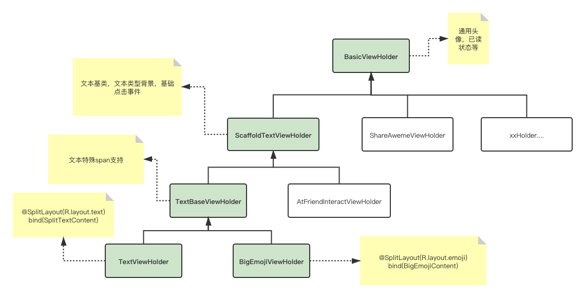
```
//1.定义纯文本数据
//这次使用@CustomResolver表示这次是自定义解析逻辑, 需要override一个函数resolve，表示对于一个给定的eachMsg，是否能解析成TextData
//其他不变
@CustomResolver
open class TextData(msg: Message) : BaseData<TextContent>(msg) {
    override fun resolve(eachMsg: Message): Boolean {
        return if (eachMsg.msgType == PlatformEnum.MessageType.TEXT) {
            !isBigEmoji(eachMsg)
        } else {
            false
        }
    }

    protected fun isBigEmoji(msg: Message): Boolean {...}
}

//2. 定义纯文本对应的ViewHolder
@SplitViewHolderDef(contentClazz = TextData::class)
class TextViewHolderFactory : BaseViewHolderFactory<TextViewHolder>() {
    override fun createViewHolder(context: Context, parent: ViewGroup)
    : TextViewHolder {...}
}

open class TextViewHolder(itemView: View) 
: ScaffoldTextViewHolder<TextData>(itemView) {...}


//3. 定义大表情数据
@CustomResolver
class BigEmojiData(msg: Message) : TextData(msg) {
    override fun resolve(eachMsg: Message): Boolean {
        return if (eachMsg.msgType == PlatformEnum.MessageType.TEXT) {
            isBigEmoji(eachMsg)
        } else {
            false
        }
    }
}

//4. 定义大表情对应的ViewHolder
@SplitViewHolderDef(contentClazz = BigEmojiData::class)
class BigEmojiViewHolderFactory : BaseViewHolderFactory<BigEmojiViewHolder>() {
    override fun createViewHolder(context: Context, parent: ViewGroup)
    : BigEmojiViewHolder {...}
}

//Holder复用继承
class BigEmojiViewHolder(itemView: View) : TextViewHolder(itemView) {
    override fun setContentBackgroundResource(config: StyleConfig) {}
    override fun highlightBgColor() {
        basicHighLightBgColor()
    }
}
```
理解设计
1. 整个框架分为两部分，ViewHolder部分和Data部分，两者是分离的，Data部分是为了消息详情页复杂的解析逻辑设计的，而ViewHolder部分是通用的，即声明一个ViewHolderFactory即可完成ViewHolder对RecyclerView的注册，其注解可以是任意数据类
2. Data部分的注解AutoResolver和CustomResolver分别用于处理简单映射类型和复杂的自定义逻辑类型。可以参照之前MessageViewType.java来理解
⚠️⚠️⚠️NOTE: 注意CustomResolver是对每个消息都会进行匹配，因此耗时是O(n)的，AutoResolver是hashMap映射，因此耗时是O(1)的，如果在CustomResolver用耗时逻辑会影响性能，而且customResolver的参数priority默认是Low，即默认在HashMap解析不了再解析，只有特殊情况才能设置为High
什么是简单映射？即某一个类型的msg由唯一确认的ViewHolder来处理它, 如下holder的选取可以理解是只跟msg的type有关系
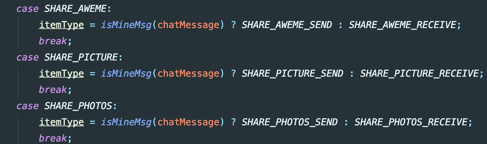
什么是复杂类型? 即解析一个msg有自定义逻辑的时候， 如下holder的选取跟msg里面的content有关系
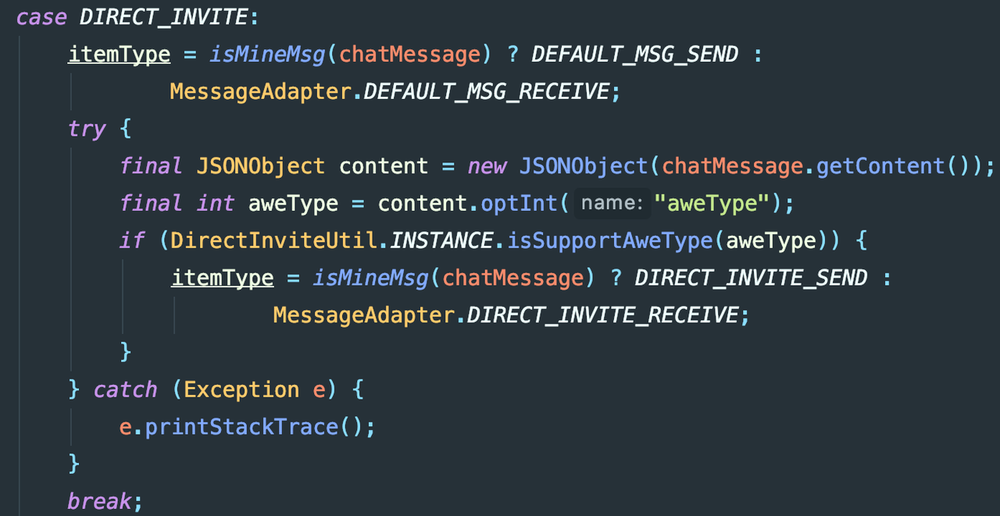
来看下数据流转 (绿色背景表示apt管理，红色部分表示业务逻辑)
向Adapter添加一个message数据，split框架根据是CustomResolver还是AutoResolver来决定如何解析成相应的Data，CustomResolver注解可以根据参数(High or Low)决定解析优先级是优于还是低于AutoResolver。拿到Data数据后，split框架从ViewTypeManager文件中去找到对应的ViewHolder，然后调用bind逻辑
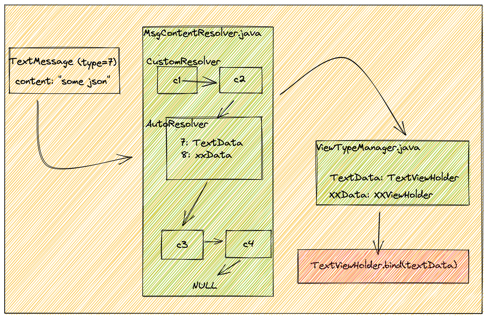
### 最佳实践： 我如何加一个新的消息类型？
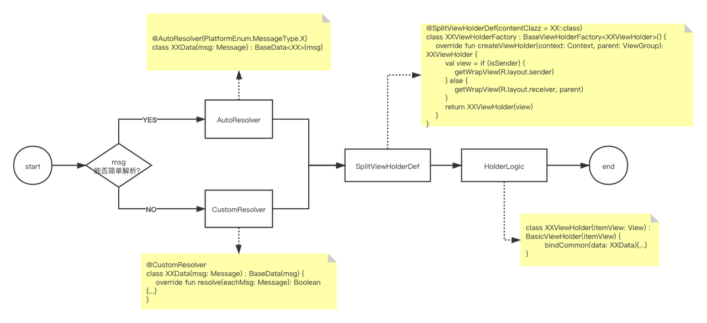
### 原理
核心原理是apt，把之前多个需要枚举的地方用apt生成代码，因此可以做到开闭原则。下面是一些代码片段，我会把msg和adapter Type以及 viewholder产生映射关系，以此来简化代码
（apt部分）
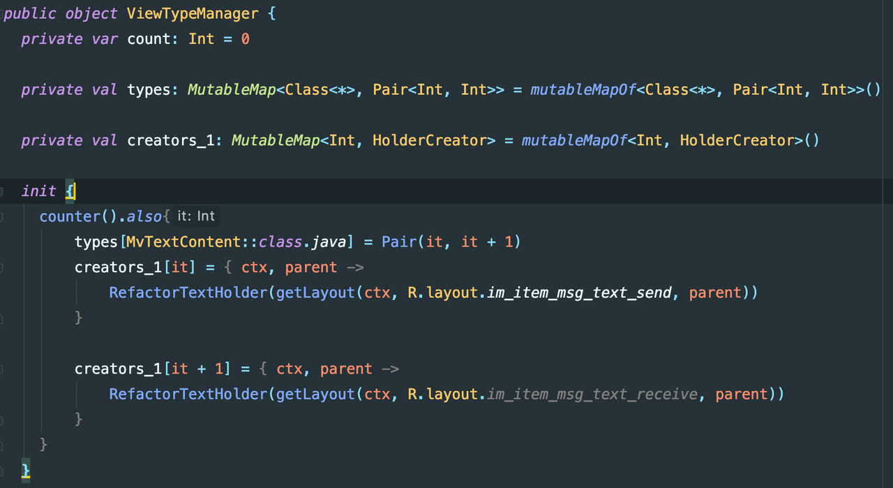
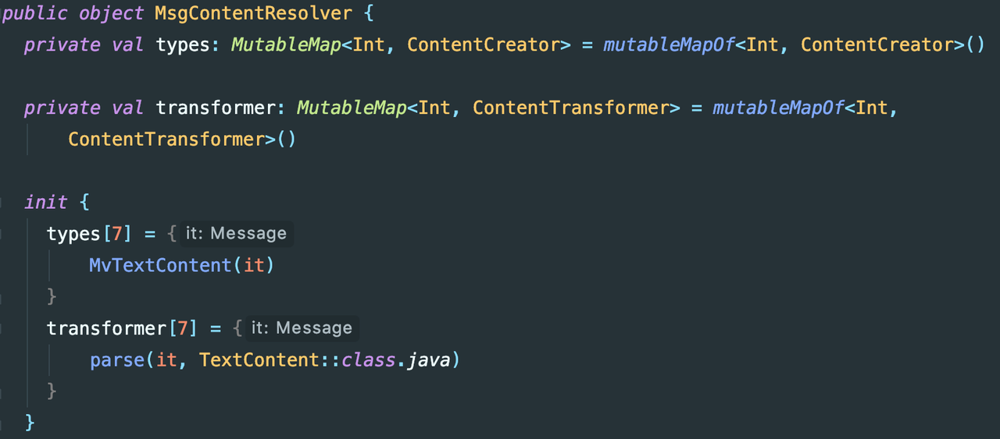
（runtime部分）
可以看到adapte部分相当简单，并且是完全贴合官方设计的，简单易懂
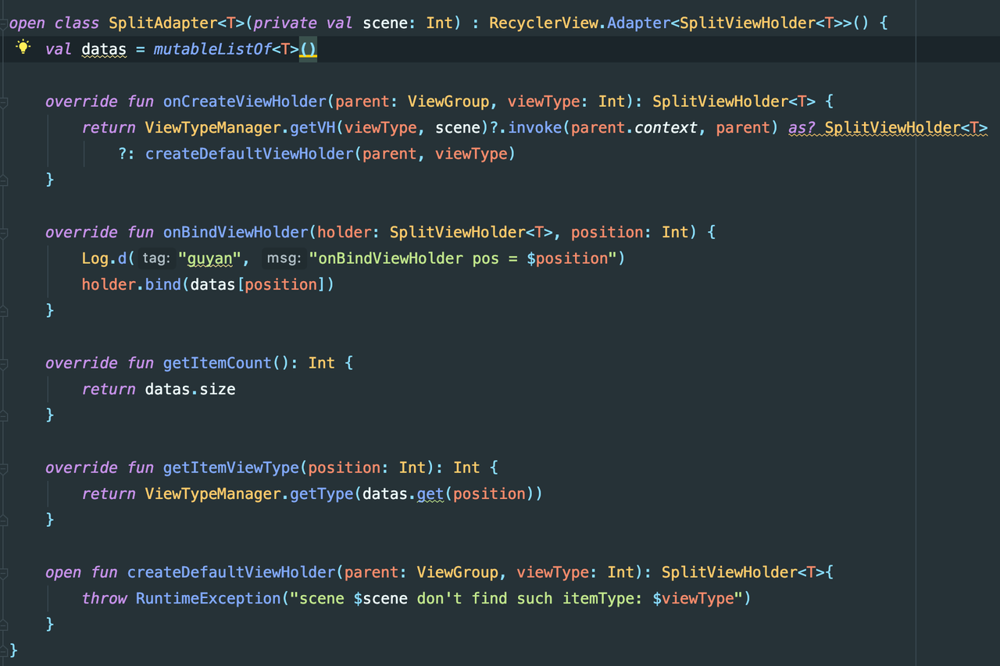
## 使用对比
### Adapter
Before: 声明很多type， 与此类无关的代码较多，逻辑复杂, line 3500+
```kotlin
public class MessageAdapter extends AbsMessageAdapter {
    public static final int NONE = -1;
    // 系统消息notice等
    public static final int SYSTEM_MSG_RECEIVE = 0;
    // 文字消息
    public static final int TEXT_MSG_RECEIVE = 1;
    public static final int TEXT_MSG_SEND = 2;
    // 分享视频消息
    public static final int SHARE_AWEME_RECEIVE = 3;
    public static final int SHARE_AWEME_SEND = 4;
    //...
 }
 ```
 After:  职责清晰，就是转换数据到ui
 ```kotlin
 open class SplitAdapter<T>(private val scene: Int) : RecyclerView.Adapter<SplitViewHolder<T>>(),ISplitMessageViewWrapper {
    val datas = mutableListOf<T>()

    init {
        ViewTypeManager.setViewWrapper(this)
    }

    override fun onCreateViewHolder(parent: ViewGroup, viewType: Int): SplitViewHolder<T> {
        return ViewTypeManager.getVH(viewType, scene)
            ?.invoke(parent.context, parent) as? SplitViewHolder<T>
            ?: createDefaultViewHolder(parent, viewType)
    }

    override fun onBindViewHolder(holder: SplitViewHolder<T>, position: Int) {
        holder.bind(datas[position])
    }

    override fun getItemCount(): Int {
        return datas.size
    }

    override fun getItemViewType(position: Int): Int {
        return ViewTypeManager.getType(datas.get(position))
    }

    open fun createDefaultViewHolder(parent: ViewGroup, viewType: Int): SplitViewHolder<T> {
        throw RuntimeException("scene $scene don't find such itemType: $viewType")
    }
}
```
### ViewHolder
before： 每个ui类型定义一种ViewHolder, 泛型指定该Msg能够解析成的数据Content， receive和send分开两个ViewHolder
```kotlin
public class TextBaseViewHolder extends ScaffoldTextViewHolder<TextContent> {
    @Override
    public void bind(Message msg, Message preMsg, TextContent content, int position) {}
```
after： 基本没有变化，泛型指定需要继承自SplitContent,  这是个简单的数据类，封装了Message和它对应的Content，因为一般来说sender和receiver的逻辑比较接近，可以看到receiver和sender是共用一个ViewHolder的，相同逻辑写入bindCommon，自己独特逻辑写入其他各自函数
```kotlin
open class TextViewHolder(itemView: View) 
: ScaffoldTextViewHolder<TextData>(itemView) {...}
class TextViewHolder(itemView: View) : BasicViewHolder<SplitTextContent>(itemView) {
    override fun bindReceiver(item: SplitTextContent) {}

    override fun bindSender(item: SplitTextContent) {}

    override fun bindCommon(item: SplitTextContent) {}
}
```
### ClickListener
Before: All in MessageAdapter,  点击事件的区分以及数据传递需要依靠View的Tag来传递，line 1000+
长按事件是否展示某个功能(复制，转发等)也需要根据Tag来区分，逻辑一旦复杂就难以维护
```kotlin
public void onClick(final View v) {
    if (v.getTag(KEY_TYPE_ITEM) == null) {return;}
    
    final Message chatMessage = (Message) v.getTag(KEY_TYPE_DATA);
    final int tagType = (int) v.getTag(KEY_TYPE_ITEM);
      
    if (tagType == TYPE_ITEM_VIDEO ||tagType == TYPE_ITEM_SHARE_PIC) {
                         //...
    }else if (tagType == TYPE_ITEM_AVATAR) {
                         //...
    }else if///...
```
```kotlin
private int convert2Flag(int tagType, boolean isSuccess, boolean isDefault, boolean isSelf, boolean isEnterPriseChat,
                         Message message, BaseContent content) {
    int flag = 0x01;
    // 如果视频不显示卡片，那么只保留长按删除，其余选项全部隐藏
    if (tagType == TYPE_ITEM_VIDEO && !AwemePreloadHelper.INSTANCE.isAwemeNormal(message)) {
        return 0x01;
    }
    //计算 copy bit
    if (tagType == TYPE_ITEM_TEXT ||
            tagType == TYPE_ITEM_STORY_REPLY ||
            tagType == TYPE_ITEM_XPLAN_DEFAULT_MSG ||
            tagType == TYPE_ITEM_SELF_STORY_REPLY ||
            tagType == TYPE_ITEM_XPLAN_HEART) {
        flag += FLAG_COPY;
    } else {
        flag += 0;
    }
    //计算 recall bit
    if (tagType == TYPE_ITEM_RED_ENVELOPE
            || tagType == TYPE_ITEM_CHAT_CALL
            || tagType == TYPE_ITEM_RED_PACKET
            || tagType == TYPE_ITEM_SHARE_FANS_COUPON_CARD
            || tagType == TYPE_ITEM_VIDEO_UPDATE_TIPS
            || tagType == TYPE_ITEM_XPLAN_HEART
            || tagType == TYPE_ITEM_SUBSCRIBE_CARD) {
        flag += 0;
    } else if (!isSuccess || isDefault || !isSelf) {
        flag += 0;
    } else {
        flag += FLAG_RECALL;
    }
   //....
}
```
After: 每个viewHolder内部自己决定是否要显示长按菜单，以及显示哪些item,  针对点击事件也可以个性化处理
```kotlin
//inside view holder
override fun provideConfig(message: Message, content: BaseContent?): LongClickConfig {
    return object : DefaultLongClickConfig(itemView.context, message, content) {
        override fun showCopy(): Boolean {
            return true
        }
    }
}

override fun provideHandler(message: Message, content: BaseContent?): LongClickHandler {
    return object : DefaultLongClickHandler(itemView.context, message, content) {
        override fun onClickCopy(v: View) {
            val text = (content as TextContent).text
            Options.copyToClipbord(v.context, text)
            val bundle: Bundle = generateBackFlowParams()
            bundle.putString(BACKFLOW_CHECK_CLIPMASSAGE, text)
            bundle.putString(Mob.ENTER_FROM, Mob.CHAT)
            ShareProxyService.shareService().runBackFlow(bundle)
        }
    }
}
```
### 参数传递
before： 如果viewHolder内部需要外部能力，比如当前会话的环境变量SessionInfo（可以知道是单聊还是群聊，半屏还是全屏等等），需要从fragment层逐层传递到需要的地方
```kotlin
//basePanel
class BaseChatPanel(val lifecycleOwner: LifecycleOwner, val rootView: View, protected val sessionInfo: SessionInfo)

//adapter
class MessageAdapter(SessionInfo sessionInfo,
                          IMUser mine) {
        mSessionInfo = sessionInfo;
}

//viewHolder
public void injectSessionInfo(SessionInfo sessionInfo) {
    this.mSessionInfo = sessionInfo;
}
```
After: 由于ViewHolder的设计是分离式的，因此需要避免层层传递的问题，基于ViewModel做了一个简单的kv存储，生命周期可以依赖于activity，可依赖于fragment，无泄漏风险
```kotlin
//basePanel
private fun injectParam() {
    InjectionViewModel.inject(mActivity, "sessionInfo", sessionInfo)
    InjectionViewModel.inject(mActivity, "LongClickDataProvider", mMessageHandle)
    InjectionViewModel.inject(mActivity, "DelegateAdapter", mMessageAdapter)
}

//viewHolder
protected val mSessionInfo: SessionInfo? = injectNullable("sessionInfo")

//context
val sessionInfo: SessionInfo? = context.injectNullable("sessionInfo")
```
编译时间影响
带有split的kapt耗时

不带有split的耗时
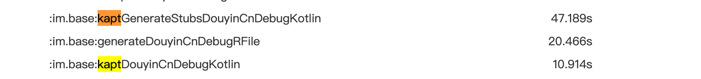
可以看到，基本没有什么影响，因为之前就用了kapt功能（butterknife），因此这次的编译耗时可以忽略不计
## 总结
Split是一种基于apt的代码生成解决方案，解决了传统RecyclerView相关的模板代码，简单易理解。其低耦合体现在各个viewholder之间相互隔离，新增类型简单快捷。其内聚性体现在各个viewholder的点击事件，展现时机等等封装在业务内部，各个组件分而治之。因此除了消息列表页，在会话列表等类型较多的RecyclerView使用的场景下，这是一个通用的解决方案